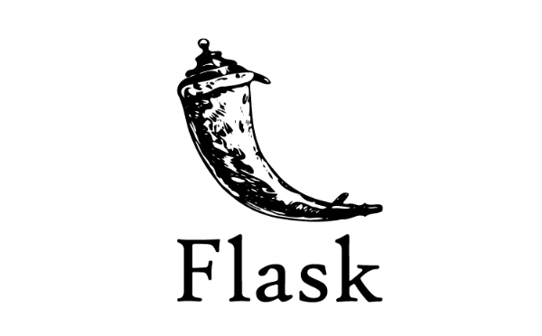
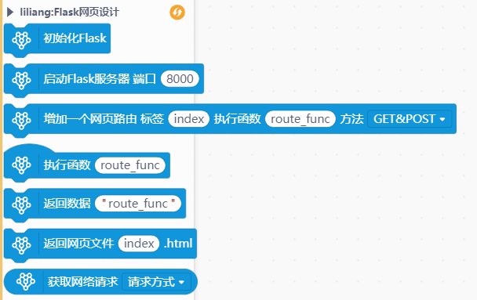
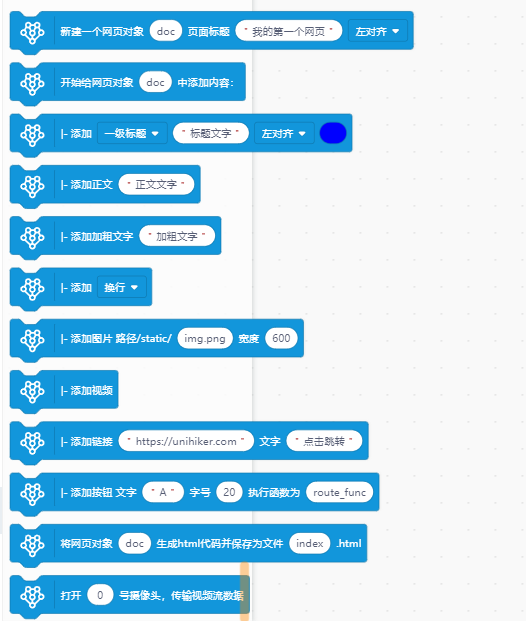
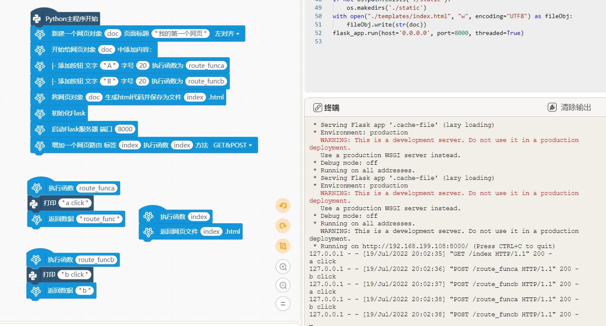
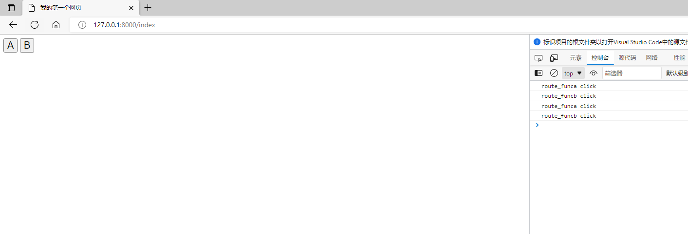

# Flask网页服务器




---------------------------------------------------------

## Table of Contents

* [URL](#url)
* [Summary](#summary)
* [Blocks](#blocks)
* [License](#license)
* [Supported targets](#Supportedtargets)

## URL
* Project URL : ```https://github.com/liliang9693/ext-pyFlaskWeb```

* Tutorial URL : ```https://mindplus.dfrobot.com.cn/extensions-user```

    


## Summary
使用Mind+V1.7.2 RC3.0及以上版本包含python模式的版本，在python模式用户库中加载此扩展，可实现使用纯python创建一个网页并在浏览器访问。

使用Flask库创建网页服务器，使用dominate库实现python生成html代码。


## Blocks
积木分成两部分，前半部分是搭建网页服务器功能，后半部分是网页内容设计。





## Examples
> 使用逻辑：
- 1、新建网页对象
- 2、给网页对象添加内容
- 3、将网页对象生成html文件
- 4、启动Flask服务器
- 5、增加网页路由，设定执行函数
- 6、执行函数中根据标签执行对应动作
- 7、浏览器打开网页查看效果





## License

MIT

## Supported targets

MCU                | JavaScript    | Arduino   | MicroPython    | Python 
------------------ | :----------: | :----------: | :---------: | -----
arduino        |             |              |             | 
micro:bit        |             |              |             | 
esp32        |             |              |             | 
unihiker        |             |              |             | √
PC        |             |              |             | √

## Release Logs

* V0.0.1  基础功能完成
* V0.0.2  增加视频图传功能
* V0.0.3  兼容多级标签
